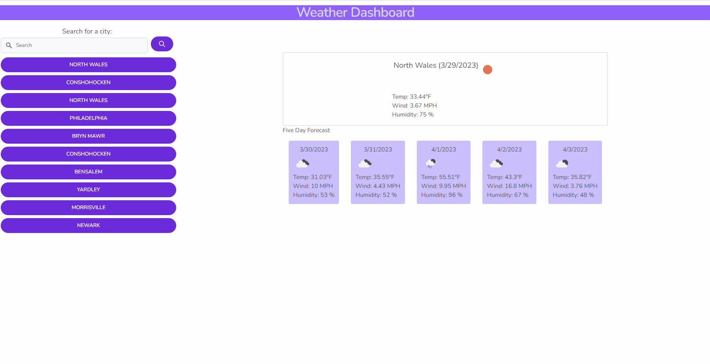

# Weather App
Case Western Coding Bootcamp Module 06 Challenge

[Live Demo](https://codemodeactivate.github.io/weather-dashboard/)



## Description
Check the 5 day weather forecast by searching for your city. I used this project as an opportunity to learn more about tailwind. My main takeaway was the importance of mobile-first if that's how the framework was designed. It took way too long to fix things going reverse. An idea for a later iteration will be to check if the previous searches match the current search and if so, we wouldn't add the search to the history, instead move the item to the top of the list.

## Notes
We got a preview of our first (group) project that we'll start soon. I noted one of the requirements was to use a CSS framework other than bootstrap. I'm going to take this opportunity to watch a few tutorials on [some that look interesting](https://github.com/troxler/awesome-css-frameworks).

I noticed one unexpected behavior where if the user searches for something that results in an error and then searches again, only one day will show instead of five for the forecast.

## Credits
[https://web.dev/fetch-api-error-handling/](https://web.dev/fetch-api-error-handling/)
[https://www.tjvantoll.com/2015/09/13/fetch-and-errors/](https://www.tjvantoll.com/2015/09/13/fetch-and-errors/)

## User Story

```md
AS A traveler
I WANT to see the weather outlook for multiple cities
SO THAT I can plan a trip accordingly
```

## Acceptance Criteria

```md
GIVEN a weather dashboard with form inputs
WHEN I search for a city
THEN I am presented with current and future conditions for that city and that city is added to the search history
WHEN I view current weather conditions for that city
THEN I am presented with the city name, the date, an icon representation of weather conditions, the temperature, the humidity, and the the wind speed
WHEN I view future weather conditions for that city
THEN I am presented with a 5-day forecast that displays the date, an icon representation of weather conditions, the temperature, the wind speed, and the humidity
WHEN I click on a city in the search history
THEN I am again presented with current and future conditions for that city
```

## Mock-Up

